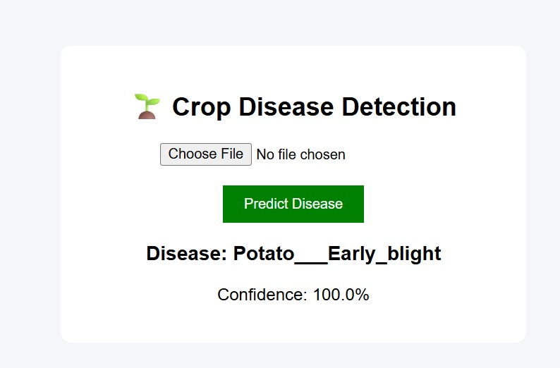

# 🌾 Crop Disease Prediction Using CNN

[](https://www.python.org/)
[](https://www.tensorflow.org/)
[](LICENSE)

---

## 📖 Introduction

Crop diseases significantly reduce yield and cause economic losses. Early detection is critical to maintaining healthy crops.  
This project uses **Convolutional Neural Networks (CNN)** to automatically detect diseases in crop leaves from images. Farmers can upload a leaf image, and the model predicts whether the leaf is **healthy** or affected by a specific disease, along with actionable suggestions.

---

## 🧠 Features

- CNN-based deep learning model for disease detection.
- Supports multiple crops and disease categories.
- User-friendly interface (web app using Flask).
- Real-time prediction with fast processing.
- Actionable suggestions for disease management.

---

## 💾 Dataset

- **Source:** [PlantVillage Dataset on Kaggle](https://www.kaggle.com/datasets/emmarex/plantdisease)  
- **Format:** JPG / PNG images  
- **Classes:** Healthy leaves + multiple disease categories (e.g., Early Blight, Powdery Mildew, Leaf Spot)

---

## 🛠️ Tech Stack

- Python 3
- TensorFlow / Keras
- OpenCV
- Flask (for web UI)
- NumPy & Pandas
- Matplotlib / Seaborn

---

## 📁 Project Structure

```bash
crop-disease-prediction/
│
├── dataset/                   # Images of crops
│   ├── Tomato/
│   │   ├── Healthy/
│   │   ├── Early_blight/
│   │   └── ...
│   └── Potato/
│       ├── Healthy/
│       └── ...
│
├── model/
│   └── crop_disease_cnn.h5    # Trained CNN model
│
├── src/
│   ├── train_model.py          # Training script
│   ├── predict.py              # Prediction script
│   └── utils.py                # Helper functions
│
├── app.py                      # Flask web app
├── templates/
│   └── index.html
├── static/
│   └── style.css
├── requirements.txt
└── README.md
